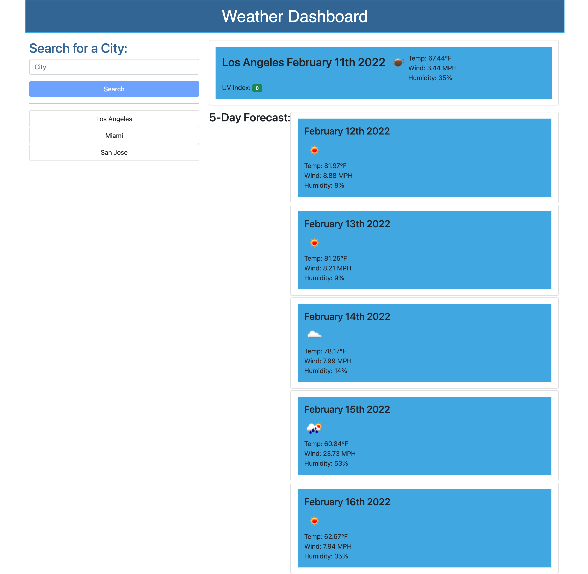

## Table of Content

- [Description](#description)
- [Usage](#usage)
- [Screenshot](#screenshot)
- [Questions](#questions)

## Description

This is my weather dashboard

## Usage

The app is used to search for city and it's weather

## Screenshot

## Question

If you have any questions please check out [my github](https://github.com/CloudyLondon/weather-dashboard) or [the live link to the application](https://cloudylondon.github.io/weather-dashboard/)
